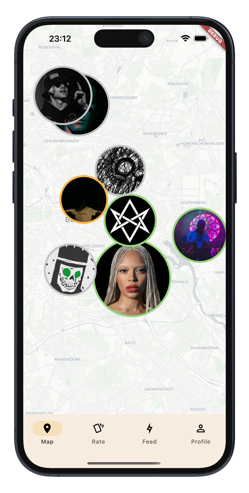

<p align="center">

</p>

# 🎵 LocalPlayer
[](https://flutter.dev)
[](#)
[](#)
[](https://pub.dev/packages/bloc)
[](https://www.prisma.io/)
[](#)

A Flutter-based social matching app that connects nearby music lovers using geolocation and Spotify integration.  
Swipe through artist profiles, explore their top tracks, and connect based on shared vibes — all powered by a beautiful map UI and swipe gestures.

## 📸 Screenshots



## 🚀 Features

- 🌍 **Interactive Map**  
  Discover nearby users on a dynamic map with zoom-based scaling and location-aware markers.

- 🎭 **Swipe-Based Matching**  
  Browse artist profiles using intuitive Tinder-style swipe gestures.

- ❤️ **Like or Dislike Profiles**  
  Like and Dislike — your choices are remembered and tracked.

- 📰 **Feed of Liked/Disliked Profiles**  
  View a personal feed of all the users you've liked or disliked for easy access and follow-up.

- 🎶 **Spotify Integration**  
  Preview top tracks from users’ Spotify artist profiles to match based on musical taste.

- 👤 **Rich User Profiles**  
  Profiles include avatar, display name, bio, location, and Spotify data.

- 📩 **Session Requests**  
  Request to join another user’s session directly from the map screen.

- 🔁 **Match Controller**  
  Central controller handles matching logic and tracks all profile interactions.

- 🧼 **Clean Architecture**  
  Follows clean separation of concerns using Bloc, Cubits, and interface-based modules.

- 📱 **Responsive UI**  
  Works on both Android and iOS devices with smooth transitions and gesture support.

- 🗺 **Popularity-Based Marker Scaling**  
  Map markers grow in size based on user popularity (number of listeners).

## 🏗 Architecture

This app follows the **Clean Architecture** pattern, ensuring maintainability, scalability, and clear separation of concerns. Each layer has a distinct role and communicates only with adjacent layers through well-defined interfaces.

### Layers

- **Presentation Layer**  
  Handles everything related to the user interface: rendering widgets, reacting to state changes, and processing user input. It communicates with the application layer to trigger business logic and display results.

- **Application Layer**  
  Acts as the middleman between the UI and the core logic. It contains controllers and use cases that coordinate user actions, business processes, and communication with external services via abstract interfaces.

- **Domain Layer**  
  Contains the pure business logic and definitions — including core entities, models, and abstract interfaces (e.g., for repositories or services). This layer is completely independent and testable on its own.

- **Data Layer**  
  Implements the interfaces defined in the domain layer. This includes network services, local storage, API clients, and data mapping logic that translates raw responses into domain models.


## ⚙️ Tech Stack

The app leverages modern Flutter tools and packages to enable a rich and modular experience:

### 🔧 Frontend
- **Flutter** 3.7.2
- **Dart** (null safety enabled)
- **flutter_map** – OpenStreetMap integration
- **flutter_card_swiper** – Tinder-style swipe interaction
- **iconify_flutter / colorful_iconify_flutter** – scalable icon support
- **google_fonts** – custom typography
- **webview_flutter**, **audioplayers** – multimedia playback

### 📡 Networking & API
- **dio** – powerful HTTP client
- **http** – used for lightweight or fallback requests
- **url_launcher** – open Spotify links
- **oauth2** – authorization with Spotify

### 🎶 Spotify Integration
- Retrieves top tracks, artist info, and playback preview from Spotify’s Web API

### 🧠 State Management
- **Bloc / Cubit** – reactive state containers for Match, Map, and Spotify logic
- **flutter_bloc** – UI integration with Bloc pattern

### 📦 Dependency Injection
- **Provider** – feature-based dependency provisioning (e.g., `MatchModule`, `MapModule`)

### 🗄 Persistence & Local Storage
- **shared_preferences** – lightweight key-value storage
- **path_provider** – access device file directories
- **ini** – for reading configuration files

### 🌐 Backend
- **Bun + Prisma** – backend service built with Bun runtime and Prisma ORM
- Provides user profile data, session handling, and Spotify connection logic

## 🛠 Installation

Follow these steps to run the app locally:

### 🔧 Prerequisites
- [Flutter SDK 3.7.2](https://flutter.dev/docs/get-started/install)
- Dart >= 3.0
- Android Studio or VS Code
- A running backend (e.g., Prisma + Bun)
- A Spotify Developer Account (for client credentials)

---

### 🚀 Steps

1. **Clone the repository**

    ```bash
    git clone https://github.com/glaciyan/localplayer.git
    cd localplayer
    ```

2. **Install Flutter dependencies**

    ```bash
    flutter pub get
    ```

3. **Run the app**

    ```bash
    flutter run
    ```

---

### 📡 API Configuration

Create a `.env` file in the root directory (or use a package like `flutter_dotenv`), and include the following:

```env
SPOTIFY_CLIENT_ID=your_spotify_client_id
SPOTIFY_CLIENT_SECRET=your_spotify_client_secret
BACKEND_URL=http://localhost:3000  # or your deployed API

